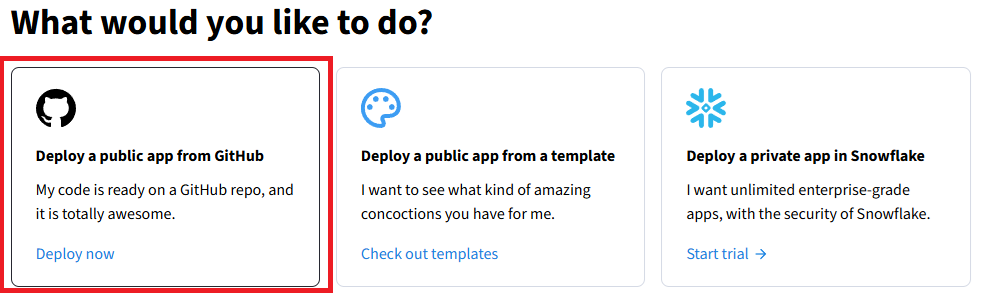
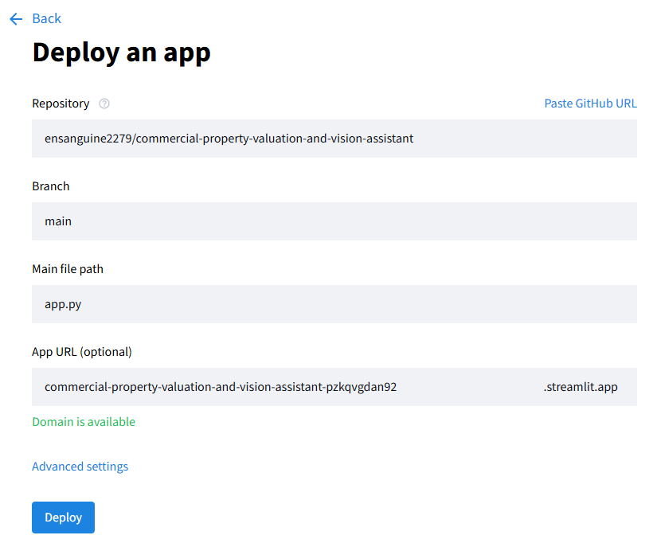
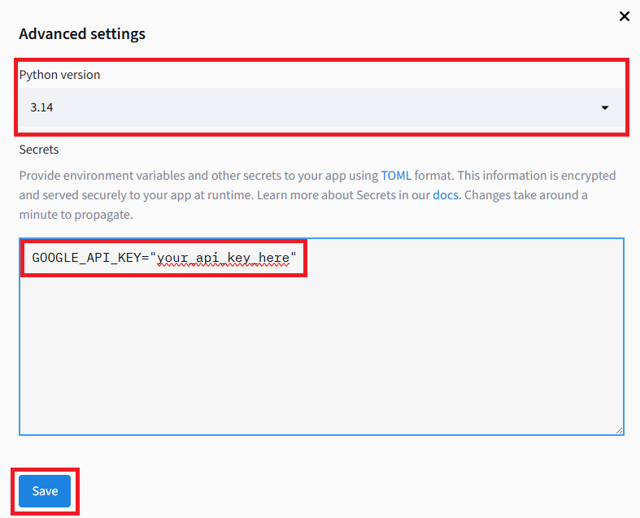

# Commercial Property Valuation and Vision Asistant

This repo aims to prototype a web application that evaluates commercial properties using both conventional structured data in CSV and uploaded user photos (unstructured). The prototyped is implemented as a lightweight Streamlit app powered by a multimodal Gemini3.5 model.

The application architecture involves three main steps:

1. **Visual Analysis**: The user upload photos of the property and inputs basic filters (e.g., region, property type). A multimodal model evaluates the photo to score its condition and exterior quality.

2. **Data Lookup & Hybrid Matching**: The app queries the local SQLite database (populated from the CSV) to find comparable properties based on matching filters and the AI-derived condition score.

3. **Valuation Recommendation**: The LLM synthesizes the visual assessment and database comparables to output a recommended valuation range with supporting rationale.

## Deploy on Streamlit Community Cloud

1. Create an account with [Streamlit Community Cloud](https://streamlit.io/cloud).

2. Login and click on the `Create app` button.


3. Select deploy from [GitHub](https://github.com/ensanguine2279/commercial-property-valuation-and-vision-assistant/).



4. Link the [GitHub repo](https://github.com/ensanguine2279/commercial-property-valuation-and-vision-assistant/) to the app.



5. Click on `Advanced Settings` to enter the Google API key. Click `Save` button.



6. Click the `Deploy` button.

## Running locally

Ensure you have your Google API key configured (`export GOOGLE_API_KEY="your-api-key"`).

Run the prototype locally using `uv`:

```bash
uv run streamlit run app.py
```

## Why use Streamlit

Streamlit is the leading framework for prototyping data and AI applications because it eliminates the traditional overhead of web development.

**Pure Python Stack**: Build the entire user interface—sliders, file uploaders, metrics, and data tables—using standard Python functions without needing to write HTML, CSS, or JavaScript.

**Built-in Multimodal Components**: Handling file uploads (st.file_uploader) and displaying images (st.image) requires only a couple of lines, making it ideal for the vision-based property app built.

**Instant State and Caching**: Features like @st.cache_resource make it effortless to load a 10,000-row CSV or initialize a SQLite database once, preventing the app from lagging every time a user interacts with a filter.

**Rapid Iteration Cycle**: When you update your script, Streamlit automatically refreshes the browser window live, allowing you to test changes to your AI prompts and UI instantly.

**Frictionless Free Hosting**: Streamlit Community Cloud ties directly into GitHub, meaning you can publish your local script to a public URL in less than two minutes without managing servers or configuring cloud infrastructure manually.

