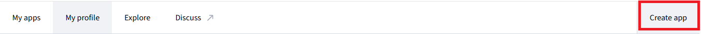
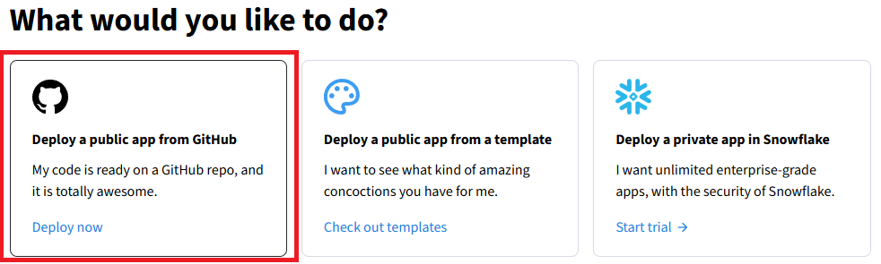
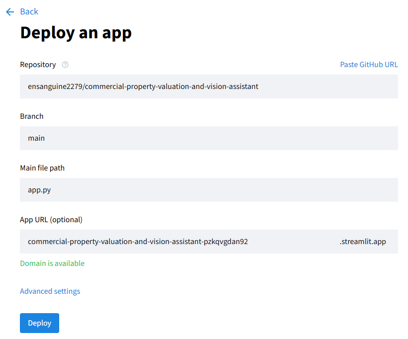
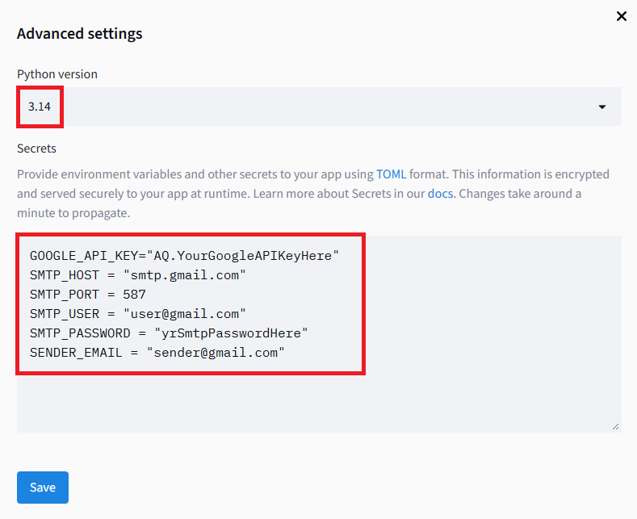
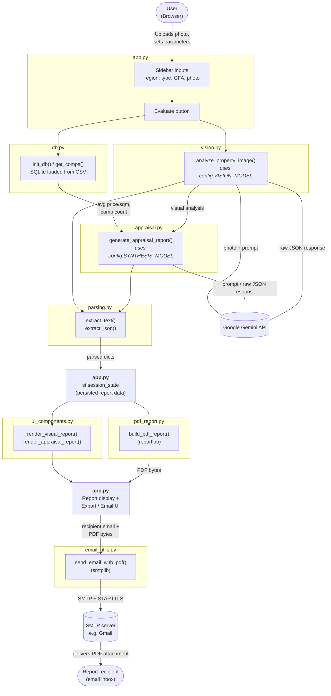

# Commercial Property Valuation and Vision Asistant

This repo aims to prototype a web application that evaluates commercial properties using both conventional structured data in CSV and uploaded user photos (unstructured). The prototyped is implemented as a lightweight Streamlit app powered by a multimodal Gemini3.5 model.

The application architecture involves three main parts:

1. **Visual Analysis**: The user upload photos of the property and inputs basic filters (e.g., region, property type). A multimodal model evaluates the photo to score its condition and exterior quality.

2. **Data Lookup & Hybrid Matching**: The app queries the local SQLite database (populated from the CSV) to find comparable properties based on matching filters and the AI-derived condition score.

3. **Valuation Recommendation**: The LLM synthesizes the visual assessment and database comparables to output a recommended valuation range with supporting rationale.

## Deploy on Streamlit Community Cloud

1. Create an account with [Streamlit Community Cloud](https://streamlit.io/cloud).

2. Login and click on the `Create app` button.



3. Select deploy from [GitHub](https://github.com/ensanguine2279/commercial-property-valuation-and-vision-assistant/).



4. Link the [GitHub repo](https://github.com/ensanguine2279/commercial-property-valuation-and-vision-assistant/) to the app.



5. Click on `Advanced Settings` to enter the Google API key and SMTP settings. Click `Save` button.



6. Click the `Deploy` button.

7. After provisioning the environment and dependencies, the app will be available at a url that comprises of the app name and a random generated string (e.g. [https://commercial-property-valuation-and-vision-assistant-fbqvslkmsmw.streamlit.app](https://commercial-property-valuation-and-vision-assistant-fbqvslkmsmw.streamlit.app))

> As with most free tier hosted apps, Streamlit Community Cloud will hibernates apps to conserve resources after a period of inactivity. Any new visits will trigger the app to wake up, as it reclones the repo and reinstalls the dependencies. So expect a slight delay when visiting the app when it is waking up.

## Running locally

Ensure you have your Google API key configured (`export GOOGLE_API_KEY="your-api-key"`).

Run the prototype locally using `uv`:

```bash
uv run streamlit run app.py
```

## Why use Streamlit

Streamlit is the leading framework for prototyping data and AI applications because it eliminates the traditional overhead of web development.

**Pure Python Stack**: Build the entire user interface—sliders, file uploaders, metrics, and data tables—using standard Python functions without needing to write HTML, CSS, or JavaScript.

**Built-in Multimodal Components**: Handling file uploads (st.file_uploader) and displaying images (st.image) requires only a couple of lines, making it ideal for the vision-based property app built.

**Instant State and Caching**: Features like @st.cache_resource make it effortless to load a 10,000-row CSV or initialize a SQLite database once, preventing the app from lagging every time a user interacts with a filter.

**Rapid Iteration Cycle**: When you update your script, Streamlit automatically refreshes the browser window live, allowing you to test changes to your AI prompts and UI instantly.

**Frictionless Free Hosting**: Streamlit Community Cloud ties directly into GitHub, meaning you can publish your local script to a public URL in less than two minutes without managing servers or configuring cloud infrastructure manually.

## System Architecture

This diagram shows how the Streamlit app's modules interact with each other
and with the two external services: the Google Gemini API (LLM calls) and
an SMTP server (email delivery).


```mermaid
flowchart TD
    User(["User<br/>(Browser)"]) -->|"Uploads photo,<br/>sets parameters"| Sidebar

    subgraph App["app.py"]
        Sidebar["Sidebar inputs<br/>region, type, GFA, photo"]
        Button["Evaluate button"]
        Sidebar --> Button
    end

    subgraph Vision["vision.py"]
        VisionCall["analyze_property_image()<br/><i>uses config.VISION_MODEL</i>"]
    end

    subgraph DB["db.py"]
        Comps["init_db() / get_comps()<br/>SQLite loaded from CSV"]
    end

    subgraph Appraisal["appraisal.py"]
        SynthCall["generate_appraisal_report()<br/><i>uses config.SYNTHESIS_MODEL</i>"]
    end

    Gemini[("Google Gemini API")]

    subgraph Parsing["parsing.py"]
        Parse["extract_text()<br/>extract_json()"]
    end

    State["<b>app.py</b><br/>st.session_state<br/>(persisted report data)"]

    subgraph UI["ui_components.py"]
        Render["render_visual_report()<br/>render_appraisal_report()"]
    end

    subgraph PDF["pdf_report.py"]
        BuildPDF["build_pdf_report()<br/>(reportlab)"]
    end

    Display["<b>app.py</b><br/>Report display +<br/>Export / Email UI"]

    subgraph Email["email_utils.py"]
        SendEmail["send_email_with_pdf()<br/>(smtplib)"]
    end

    SMTP[("SMTP server<br/>e.g. Gmail")]
    Recipient(["Report recipient<br/>(email inbox)"])

    Button --> VisionCall
    Button --> Comps

    VisionCall ---|"photo + prompt"| Gemini
    Gemini ---|"raw JSON response"| VisionCall
    Comps -->|"avg price/sqm,<br/>comp count"| SynthCall
    VisionCall -->|"visual analysis"| SynthCall
    SynthCall ---|"prompt / raw JSON response"| Gemini

    VisionCall --> Parse
    SynthCall --> Parse
    Parse -->|"parsed dicts"| State

    State --> Render --> Display
    State --> BuildPDF -->|"PDF bytes"| Display

    Display -->|"recipient email +<br/>PDF bytes"| SendEmail
    SendEmail -->|"SMTP + STARTTLS"| SMTP -->|"delivers PDF attachment"| Recipient
```

### Module responsibilities

| Module | Responsibility |
|---|---|
| `app.py` | Streamlit UI flow: sidebar inputs, button handling, session-state persistence, orchestration of all other modules |
| `config.py` | Shared model name constants |
| `db.py` | Loads the comps CSV into SQLite once (`init_db`) and queries it (`get_comps`) |
| `vision.py` | Sends the uploaded photo + prompt to the Gemini vision model |
| `appraisal.py` | Sends the visual analysis + comps data to the Gemini synthesis model for the structured appraisal |
| `parsing.py` | Normalizes LLM response content and extracts the JSON object from it |
| `ui_components.py` | Renders the parsed JSON as styled HTML report cards in Streamlit |
| `pdf_report.py` | Renders the same report content as a downloadable PDF (reportlab) |
| `email_utils.py` | Sends the PDF as an email attachment over SMTP |

### Data flow summary

1. The user uploads a photo and sets region / property type / GFA in the sidebar, then clicks **Evaluate**.
2. `vision.py` sends the photo to Gemini and gets back a visual condition analysis.
3. `db.py` queries SQLite for comparable transactions and computes the baseline valuation.
4. `appraisal.py` sends the visual analysis + baseline data to Gemini, which returns a structured appraisal (executive summary, adjustment, final value opinion, etc.).
5. `parsing.py` extracts clean JSON from both Gemini responses; the parsed data is stored in `st.session_state` so it survives Streamlit's rerun cycle.
6. `ui_components.py` renders the stored data as on-screen report cards.
7. `pdf_report.py` renders the same data as a PDF, available for direct download.
8. If the user enters a recipient email, `email_utils.py` sends that PDF as an attachment via SMTP.
