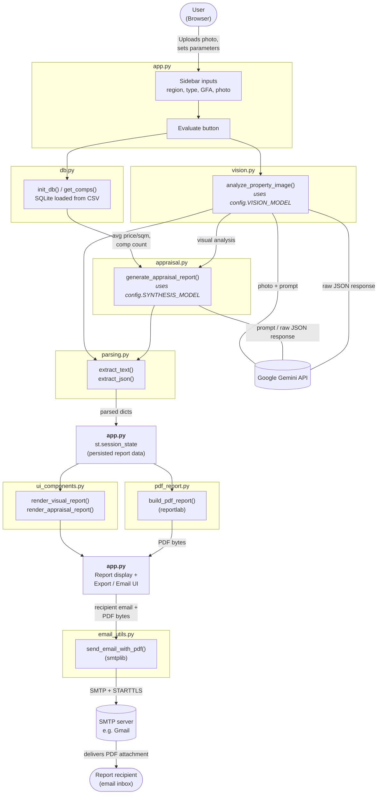

# System Architecture — Commercial Property Valuation & Vision Assistant

This diagram shows how the Streamlit app's modules interact with each other
and with the two external services: the Google Gemini API (LLM calls) and
an SMTP server (email delivery).

## Module responsibilities

| Module | Responsibility |
|---|---|
| `app.py` | Streamlit UI flow: sidebar inputs, button handling, session-state persistence, orchestration of all other modules |
| `config.py` | Shared model name constants |
| `db.py` | Loads the comps CSV into SQLite once (`init_db`) and queries it (`get_comps`) |
| `vision.py` | Sends the uploaded photo + prompt to the Gemini vision model |
| `appraisal.py` | Sends the visual analysis + comps data to the Gemini synthesis model for the structured appraisal |
| `parsing.py` | Normalizes LLM response content and extracts the JSON object from it |
| `ui_components.py` | Renders the parsed JSON as styled HTML report cards in Streamlit |
| `pdf_report.py` | Renders the same report content as a downloadable PDF (reportlab) |
| `email_utils.py` | Sends the PDF as an email attachment over SMTP |

## Data flow summary

1. The user uploads a photo and sets region / property type / GFA in the sidebar, then clicks **Evaluate**.
2. `vision.py` sends the photo to Gemini and gets back a visual condition analysis.
3. `db.py` queries SQLite for comparable transactions and computes the baseline valuation.
4. `appraisal.py` sends the visual analysis + baseline data to Gemini, which returns a structured appraisal (executive summary, adjustment, final value opinion, etc.).
5. `parsing.py` extracts clean JSON from both Gemini responses; the parsed data is stored in `st.session_state` so it survives Streamlit's rerun cycle.
6. `ui_components.py` renders the stored data as on-screen report cards.
7. `pdf_report.py` renders the same data as a PDF, available for direct download.
8. If the user enters a recipient email, `email_utils.py` sends that PDF as an attachment via SMTP.
